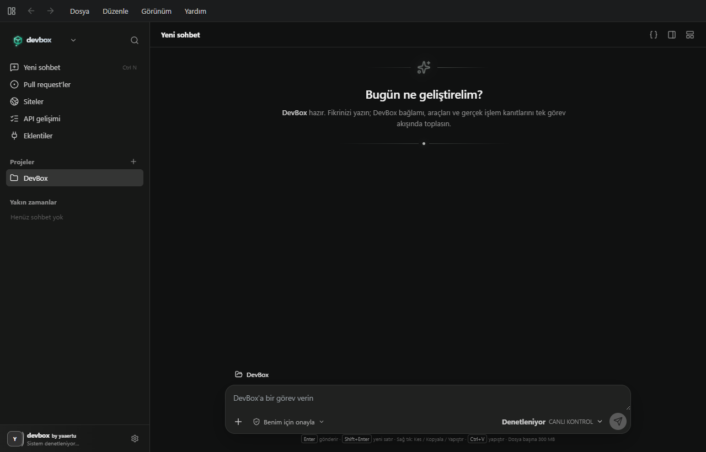
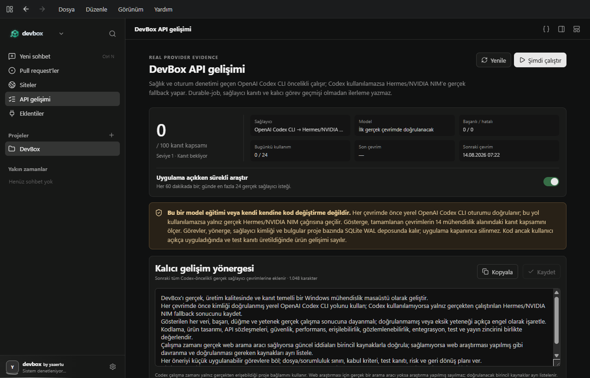
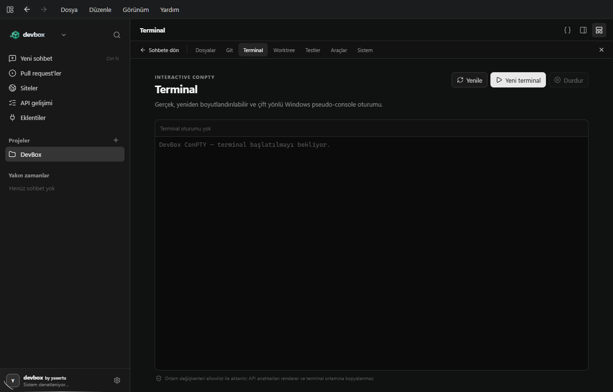

# DevBox

> Windows üzerinde proje, sohbet, Git, terminal ve kanıt akışını tek yerde toplayan açık kaynak mühendislik masaüstü.

[](https://github.com/ertucaymaz-afk/DevBox/releases/latest)
[](https://github.com/ertucaymaz-afk/DevBox/actions/workflows/ci.yml)
[](LICENSE)
[](https://github.com/ertucaymaz-afk/DevBox/releases)



DevBox; yerel projeyle konuşmayı, dosyaları incelemeyi, değişiklikleri izlemeyi ve gerçek araçları çalıştırmayı aynı çalışma alanında buluşturur. Bir özellik makinede gerçekten hazır değilse yeşil bir “başarılı” rozeti göstermez: neden kullanılamadığını açıkça söyler.

## 🚀 Son sürüm ve yenilikler

Yeni sürümler; kurucu, taşınabilir ZIP, SHA-256 sağlama toplamları, SBOM ve dürüst imza durumuyla birlikte [GitHub Releases](https://github.com/ertucaymaz-afk/DevBox/releases/latest) sayfasında yayımlanır. Önceki sürümler ve değişiklik geçmişi için [tüm yayınları](https://github.com/ertucaymaz-afk/DevBox/releases) veya [ayrıntılı sürüm notlarını](docs/RELEASE_NOTES.md) açabilirsiniz.

DevBox içindeki **Yenilikler** alanı da kurulu gerçek sürümün notlarını animasyonlu olarak gösterir. Okundu bilgisi yalnız cihazınızda saklanır; uzaktaki bir servis güncelleme varmış gibi taklit edilmez.

## ✨ Neler var?

- Sohbet odaklı, koyu ve sıkı bir Windows arayüzü
- Mesaj gönderme, düzenleme, kopyalama, yapıştırma, alıntılama ve yeniden oluşturma kontrolleri
- Kes / Kopyala / Yapıştır içeren yerel sağ tık menüleri
- Her dosya için en fazla 300 MiB sürükle-bırak eki ve SHA-256 içerik kimliği
- Gerçek `node-pty` / Windows ConPTY terminal oturumları
- Gerçek Git durum, diff ve dosya bazlı ekleme/silme sayacı
- Sabit konuşmalar, arşiv, okunma durumu, otomatik başlıklar ve kalıcı SQLite geçmişi
- GitHub PR / issue / check / CI / release ve Vercel komut yolları
- Worktree yaşam döngüsü, dayanıklı görevler, lease ve yeniden başlatma kurtarması
- Gerçek TypeScript/JavaScript LSP tanıları ve seçilebilir hata ayıklama adaptörü üzerinden DAP kontrol yüzeyi
- Tek kullanımlık eşleştirme, iptal edilebilir kimlik, sağlık sinyali ve çökme kurtarması kullanan uzak çalışan protokolü
- Yerel geri döngü adresinde erişim anahtarıyla kimlik doğrulayan DevBox v1 API’si
- Sağlık ve oturum denetimi geçen Codex CLI öncelikli API gelişim araştırması; yalnızca gerçek çağrı başarısız olursa yapılandırılmış Hermes/NVIDIA NIM geri dönüşü

DevBox’ta demo yanıt, sahte entegrasyon sonucu, simüle edilmiş ilerleme ya da uydurma “hazır” durumu bulunmaz. Çalışmayan bir yol, kanıt üretmek yerine hata durumuna geçer.

## 🧭 Çalışma alanı



API gelişimi ekranı bir modelin kendi kendine eğitim gördüğünü iddia etmez. Gerçek sağlayıcı çağrılarından gelen araştırma sonucu, görev kimliği, zaman, sağlayıcı ve hata kanıtı SQLite WAL veritabanında saklanır. Uygulama kapatıldığında geçmiş kaybolmaz. Otomatik çevrimler güvenli araştırma ve backlog üretir; kaynak kodu kullanıcı onayı olmadan değiştirmez.



Terminal görünümü Windows sözde konsolu üzerinde çift yönlüdür. Giriş, çıkış, yeniden boyutlandırma ve sonlandırma yaşam döngüsü gerçek süreçle bağlıdır; hem “Sohbete dön” hem de görünür kapatma düğmesi vardır.

## 📦 Kurulum

En güncel `DevBox-Setup.exe`, `devbox.zip`, sağlama toplamları ve sürüm manifesti için [GitHub Releases](https://github.com/ertucaymaz-afk/DevBox/releases) sayfasını kullanın.

1. `SHA256SUMS.txt` içindeki özeti indirdiğiniz dosyayla karşılaştırın.
2. `DevBox-Setup.exe` dosyasını çalıştırın.
3. Kurulum Başlat menüsüne ve masaüstüne DevBox kısayolu ekler.

Kaldırmak için **Windows Ayarları → Uygulamalar → Yüklü uygulamalar → DevBox → Kaldır** yolunu kullanın. Yanlışlıkla kaldırmanın sohbet geçmişini yok etmemesi için kullanıcı verileri otomatik silinmez.

## 🛠️ Kaynaktan derleme

Gerekenler: Windows 11, Node.js 24+, pnpm 11.19.0 ve Git.

```powershell
corepack enable
corepack prepare pnpm@11.19.0 --activate
pnpm install --frozen-lockfile
pnpm verify
pnpm package:installer
```

`pnpm verify`; TypeScript denetimini, birim/sözleşme testlerini, üretim derlemesini ve ürün-doğruluk denetimini çalıştırır. İmzalı paket yolu olan `pnpm package:signed`, kullanılabilir gerçek bir Authenticode kimliği yoksa bilinçli olarak başarısız olur.

## 🌐 Uzak çalışan

DevBox API yalnız `127.0.0.1` üzerinde dinler. Uzak bir makineyi doğrudan internete açık bir porta bağlamak yerine güvenilen SSH tüneli kullanın:

1. **Eklentiler ve entegrasyonlar → Dayanıklı uzak çalışanlar** bölümünden eşleştirme kodu oluşturun.
2. Uzak makinede ekranda verilen SSH local-forward komutunu çalıştırın.
3. Açık kaynak arşivindeki `scripts/remote-worker.mjs` dosyasını, ekranda verilen ortam değişkenleriyle başlatın.
4. Uzak çalışan ilk bağlantıda erişim anahtarını kullanıcı profilindeki `.devbox/worker-token` dosyasına yazar. Kod tekrar kullanılamaz; uygulamadan uzak çalışanın yetkisi kalıcı olarak kaldırılabilir.

Uzak çalışan yalnız `git`, `node`, `pnpm`, `npm`, `pwsh` ve `dotnet` komutlarını `shell: false` ile çalıştırır; çalışma dizini seçilen proje kökünün dışına çıkamaz. Çok saatli temiz Windows sanal makine dayanıklılık işi `.github/workflows/windows-resilience.yml` içindedir. İş akışı sonucu yayımlanmadan veya gerçek iki makine testi yapılmadan uzak ağ dayanıklılığı “kanıtlandı” diye sunulmaz.

## 🔐 Gizlilik ve güvenlik

DevBox reklam telemetrisi veya ürün analitiği göndermez. Yerel proje, sohbet, ayar, ek ve kanıt verileri; kullanıcı dış sağlayıcı ya da entegrasyon çağrısını açıkça başlatmadıkça makineden çıkmaz. Ayrıntılar [gizlilik](docs/policies/PRIVACY.md), [güvenlik](.github/SECURITY.md) ve [kod imzalama](docs/policies/CODE_SIGNING_POLICY.md) belgelerinde bulunur.

SignPath Foundation açık kaynak başvurusu proje geliştiricisi tarafından **14 Ağustos 2026 tarihinde gönderildi**. Başvuru şu anda dış inceleme ve projeyi kabul sürecindedir. SignPath onayı ve gerçek güven kökü gelene kadar yayımlanan Windows dosyaları `İMZASIZ (NOT_SIGNED)` olarak işaretlenir; kendinden imzalı bir sertifika yayın kimliği gibi sunulmaz.

## 👤 Geliştirici

DevBox, **Yaaertu** tarafından geliştiriliyor.

- GitHub ve depo sahibi: [@ertucaymaz-afk](https://github.com/ertucaymaz-afk)
- Instagram: [@yaaertu](https://www.instagram.com/yaaertu/)
- Ürün/geliştirici imzası: **devbox by yaaertu**

`yaaertu` ürün ve sosyal medya kimliğidir. GitHub’da doğrulanmış mevcut hesap ve bu deponun gerçek sahibi `ertucaymaz-afk` olduğu için CODEOWNERS ve yayın kaynağı bu hesapta tutulur. Geliştirici, sorumluluk ve iletişim ayrıntıları için [geliştirici belgesine](docs/DEVELOPERS.md) bakın.

## 🤝 Katkı

Katkılar Apache-2.0 kapsamında açıktır. Başlamadan önce [katkı rehberini](.github/CONTRIBUTING.md) ve [davranış kurallarını](.github/CODE_OF_CONDUCT.md) okuyun. Kimlik bilgisi, özel kullanıcı verisi, yerel veritabanı, derleme klasörü veya doğrulanmamış başarı iddiası göndermeyin.

Ürün, sürüm, gizlilik ve kod imzalama belgelerinin kompakt dizini için [docs/README.md](docs/README.md) sayfasını kullanın. Derleme ve test araçlarının ayrıntılı ayarları kök listeyi kalabalıklaştırmamak için `config/` altında tutulur.

## 📄 Lisans

Copyright 2026 DevBox katkıcıları. Bağlayıcı [Apache License 2.0](LICENSE) metniyle lisanslanmıştır. Daha kolay okunabilen fakat hukuken bağlayıcı olmayan [Türkçe lisans özetine](docs/policies/LISANS-OZETI.md) de bakabilirsiniz.
