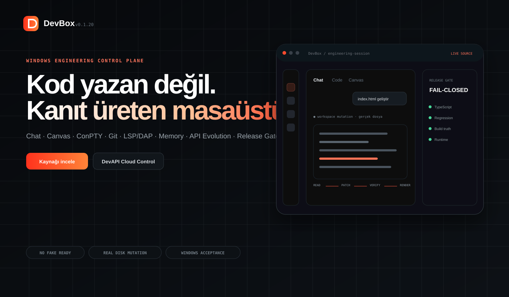
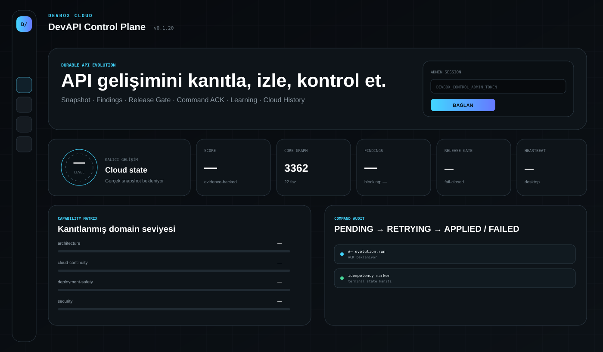
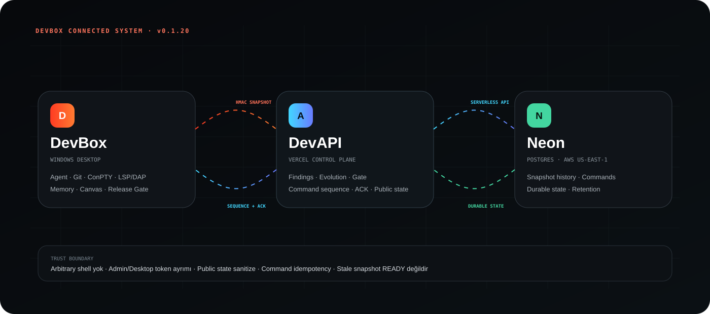

# DevBox v0.1.20

**DevBox**, Windows üzerinde çalışan; sohbet, gerçek dosya/kod değişikliği, terminal, Git, TypeScript/JavaScript LSP, DAP debug, kalıcı hafıza, izole API Evolution, release gate ve cloud DevAPI kontrol düzlemini tek masaüstünde birleştiren açık kaynak mühendislik uygulamasıdır.

> **Gerçeklik sözleşmesi:** Simülasyon, sahte entegrasyon sonucu, uydurma PASS/READY, demo telemetrisi, no-op geliştirme ve çalışmayan buton başarı kabul edilmez. Kanıt üretmeyen yol açık hata/finding durumuna geçer.

<p align="center"></p>

## 🌐 Canlı yüzeyler

| Yüzey | Hedef | Gerçek durum |
|---|---|---|
| DevAPI Cloud Control | `https://devapi-virid.vercel.app` | **BLOCKED_STALE_PRODUCTION** · production hâlâ v0.4.1, v0.1.20 kaynak henüz promote edilmedi |
| DevBox ürün sitesi | istenen `https://devbox.vercel.app` | **BLOCKED_PROJECT_OWNERSHIP** · bağlı Vercel takımında `devbox` projesi doğrulanmadı |
| GitHub | `https://github.com/ertucaymaz-afk/DevBox` | kaynak gerçeklik merkezi |
| Neon | `devbox-devapi-control` | gerçek proje + main branch + DevAPI tabloları read-back **PASS** |

Production kanıtı `cloud/production-evidence.json` içinde fail-closed tutulur. Eksik deployment/alias/env/canary bilgisi READY sayılmaz.

## ✨ Neler var?

- Sohbet odaklı **koyu / gündüz / sistem** temalı Windows arayüzü; bağımsız yüzey/kontrast tokenları ve alev-kırmızısı primary action sistemi.
- Mesaj gönderme, düzenleme, kopyalama, yapıştırma, alıntılama ve yeniden oluşturma; provider beklerken yeni sohbet açılabilir.
- Aynı thread için gerçek **FIFO** koordinatörü; cross-thread paralellik, re-entrancy ve stale-response koruması.
- Kes / Kopyala / Yapıştır içeren yerel sağ tık menüleri.
- Her dosya için en fazla **300 MiB** sürükle-bırak eki ve SHA-256 içerik kimliği; limit dosya belleğe alınmadan fail-closed kontrol edilir.
- Gerçek `node-pty` / Windows **ConPTY** terminal oturumları.
- Gerçek Git status/diff, dosya bazlı ekleme/silme sayacı ve izole worktree yaşam döngüsü.
- Sabit konuşmalar, arşiv, okunma durumu, otomatik başlıklar ve kalıcı **SQLite + FTS5** geçmiş/hafıza sistemi.
- Hafızada preference, constraint, decision ve context katmanları; dedup, pruning, secret filtresi ve scope-güvenli retrieval.
- Gerçek TypeScript/JavaScript LSP tanıları; proje başına yeniden kullanılan bounded LSP session havuzu, belge LRU bütçesi ve Windows canonical URI eşleştirmesi.
- Yerleşik Microsoft `vscode-js-debug` tabanlı gerçek **DAP**: thread, stack, scope, variable, stepping ve breakpoint.
- GitHub PR / issue / check / CI / release ve Vercel komut yolları.
- Worktree, dayanıklı görev, lease, heartbeat ve restart recovery.
- Yerel loopback adresinde erişim anahtarıyla kimlik doğrulayan **DevBox v1 API**.
- Hızlı Hermes one-shot normal sohbet yolu; sonuç üretmezse redacted-session fallback.
- Workspace görevlerinde gerçek file/terminal araç döngüsü, disk mutasyonu ve read-back doğrulaması.
- **Canvas canlı kod akışı:** dosya önce Kod sekmesinde gerçek disk içeriğiyle görünür; SHA/read-back ve gerçek Electron offscreen render kapısından sonra Preview açılır.
- Preview gate; DOM görünürlüğü, console/CSP hataları, load failure ve gerçek frame piksel dağılımını denetler. Beyaz/boş render PASS değildir.
- **RemixRota** companion entegrasyonu: current-user Windows named pipe, capability handshake, dar allowlist, malformed-event ve stale-process koruması.

## 🧠 API Evolution

DevAPI/API Evolution, masaüstündeki bir progress kartından ibaret değildir. `ApiEvolutionService`, development spec, finding registry, release gate, Git/worktree evidence, AgentService ve cloud continuity sözleşmesi birlikte çalışır.

Çekirdek plan **22 faz / 3362 atomik görev** içerir. Çekirdek tamamlandığında sistem durmaz; `ADAPT-*` görevleri somut repository/runtime kanıtından üretilir. No-op değişiklik, yalnız açıklama, sahte benchmark veya test çalıştırılmadan yazılmış PASS kabul edilmez.

v0.1.20 ile adaptif kapsam genişletilir:

- `cloud-continuity`
- `deployment-safety`
- `public-api-contract`
- `command-delivery`
- `observability`
- `disaster-recovery`
- `database-performance`
- `site-performance`
- `accessibility`
- `protocol-compatibility`
- `secret-rotation`
- `dependency-provenance`

Her finding için fingerprint + severity + owner + lifecycle + evidence gerekir. `OPEN / RESOLVED / REJECTED` yaşam döngüsü ve blocking semantiği kalıcıdır.

<p align="center"></p>

## ☁️ DevAPI Cloud Control

Kaynak: `cloud/devapi-control`

Cloud sözleşmesi:

- `DATABASE_URL`
- `DEVBOX_CONTROL_PLANE_TOKEN` · desktop HMAC/Bearer · minimum 32 karakter
- `DEVBOX_CONTROL_ADMIN_TOKEN` · ayrı admin token · minimum 32 karakter
- masaüstünde `DEVBOX_CONTROL_PLANE_URL=https://...`

Desktop ve admin token aynı olamaz. Browser bundle içinde secret tutulmaz. Public endpoint secret istemez fakat sanitize edilmiş veri dışında içerik vermez.

### Kalıcı state

Gerçek Neon projesi: `delicate-heart-48380148` (`devbox-devapi-control`)

Main branch: `br-broad-frog-aua7edwl`

Read-back ile doğrulanan tablolar:

- `devbox_projects`
- `devbox_snapshot_history`
- `devbox_commands`

Snapshot history proje başına 500 kayıtla, terminal command history 90 gün / 2000 kayıt sınırıyla tutulur.

### Command ACK

Cloud control arbitrary shell veya serbest dosya komutu kabul etmez. İzinli command türleri:

- `evolution.setEnabled`
- `evolution.run`
- `evolution.cancel`

Yaşam döngüsü:

```text
PENDING
→ desktop poll
→ idempotency marker
→ gerçek local işlem
→ ACK
→ APPLIED
```

Ağ/uygulama hatasında `RETRYING`; terminal başarısızlıkta `FAILED`. Sequence sırası ve idempotency bozulmadan korunur.

### Public state

`GET /api/v1/public-state`

Public response yalnız ürün/evolution özeti taşır. Aşağıdakiler public response'a çıkmaz:

- raw `latest_snapshot`
- finding item detail/evidence
- görev promptları
- workspace/file path
- command payload
- desktop instance id
- admin/desktop token
- `DATABASE_URL`

Snapshot 120 saniyeden eskiyse `stale=true`; ürün sitesi bunu READY olarak göstermez.

## 🖥️ DevBox ürün sitesi

Kaynak: `cloud/devbox-site`

Site, DevBox’ın gerçek çalışan yeteneklerini teknik ürün vitrini olarak anlatır ve DevAPI public-state endpoint’ini 5 saniyelik bounded timeout ile okur. Endpoint yoksa veya cloud yapılandırılmamışsa level/score/finding/gate alanları `— / UNAVAILABLE` kalır.

Görsel hareketler native CSS, Web Animations ve `IntersectionObserver` tabanlıdır; `prefers-reduced-motion` desteklenir. Araştırmada Motion, Anime.js ve shadcn/ui desenleri incelenmiştir; sırf “premium” etiketi için gereksiz runtime bağımlılığı eklenmemiştir. Ayrıntı: `docs/research/v0.1.20-web-ui-research.md`.

## 🔗 Desktop ↔ DevAPI ↔ Vercel/Neon

<p align="center"></p>

- Desktop gerçek snapshot üretir ve HMAC ile cloud'a gönderir.
- DevAPI Vercel Functions üzerinden doğrulama ve control-plane API sağlar.
- Neon Postgres snapshot, history ve command ACK state'ini kalıcı tutar.
- Product site yalnız sanitize public-state okur.
- Production canonical URL'ler `cloud/product-links.json` + `cloud/production-evidence.json` ile fail-closed doğrulanır.

## 🧱 Release Gate

Ana kaynak zinciri:

```text
spec:verify
→ evolution:verify (v13, v12 ve önceki verifier'ları miras alır)
→ cloud:verify
→ TypeScript
→ regresyon testleri
→ production build
→ truth audit
```

Final production/release zinciri ayrıca:

```text
production:verify
→ DevAPI staged deploy + smoke
→ DevAPI desktop/public-state/command canary
→ DevBox staged deploy + smoke
→ cross-site link check
→ runtime error scan
→ rollback evidence
→ NSIS
→ PE/MZ + SHA-256
→ silent install
→ installed EXE hash
→ real launch
→ uninstall
→ cleanup
```

`production:verify` gerçek Vercel kanıtları PASS olmadan installer/release aşamasını açmaz.

## 🔐 Güvenlik ve supply-chain

- Demo/fake/simülasyon başarı yok.
- Secret source'a yazılmaz.
- Public state sanitize edilir.
- Project/file sınırı symlink dahil fail-closed denetlenir.
- Paket kimliği SHA-256 içerik kanıtıyla tutulur.
- Crack/warez/kırılmış binary supply-chain'e alınmaz; açık kaynak veya doğrulanabilir lisanslı araçlar kullanılır.
- Third-party notları `THIRD_PARTY_NOTICES.md` altında tutulur.

## 🚦 Production durumu

`cloud/production-evidence.json` şu an özellikle **BLOCKED** durumdadır. Bunun nedeni kaynak değil, canlı production kanıtının henüz v0.1.20 olmamasıdır:

- mevcut `devapi` production HTTP 200 fakat içerik v0.4.1;
- `/api/v1/health` ve `/api/v1/public-state` mevcut production'da 404;
- bağlı Vercel takımında `devbox` adlı ayrı proje doğrulanmadı;
- Vercel production env secret yazma yolu mevcut connector'da yok;
- v0.1.20 desktop ↔ cloud command canary henüz geçmedi.

Bu bloklar kapanmadan README veya release “production READY” iddiası yazmaz.

## Lisans

DevBox kaynak kodu Apache-2.0 lisanslıdır.
